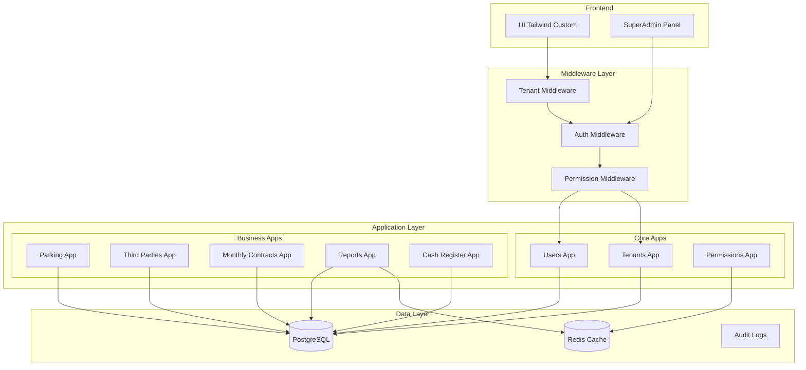
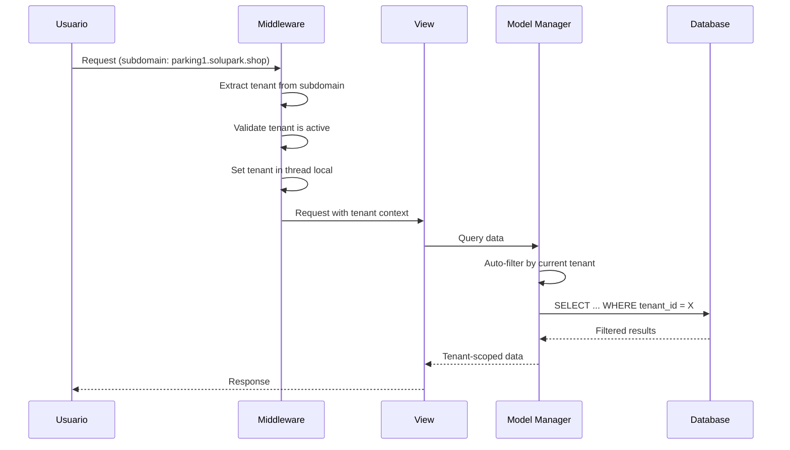
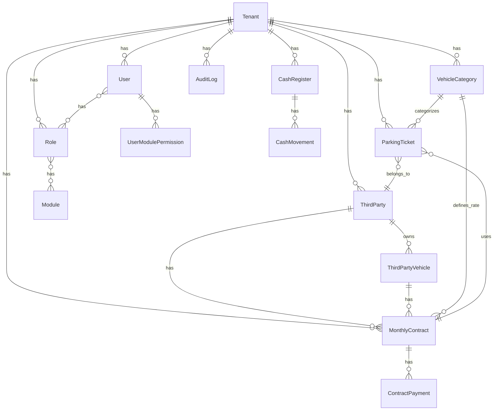

# Design Document: Arquitectura Multitenant SoluPark

## Overview

Este documento describe el diseño técnico para transformar SoluPark en una plataforma multitenant de gestión de parqueaderos. La arquitectura utiliza el patrón de "tenant compartido con discriminador" donde todos los tenants comparten la misma base de datos pero los datos se aíslan mediante una columna `tenant_id` en cada modelo.

### Decisiones Arquitectónicas Clave

1. **Estrategia Multitenant**: Shared Database with Tenant Discriminator (más eficiente para SaaS pequeño/mediano)
2. **Identificación de Tenant**: Por subdominio (parking1.solupark.shop) con fallback a header/sesión
3. **Framework de Permisos**: Sistema custom basado en módulos (más flexible que django-guardian)
4. **Auditoría**: django-auditlog para tracking automático de cambios
5. **UI Framework**: Tailwind CSS con componentes custom (evitar aspecto genérico)

---

## Architecture

### Diagrama de Arquitectura General



### Flujo de Request Multitenant



---

## Components and Interfaces

### 1. Core App: `tenants`

Gestiona la entidad Tenant y proporciona el contexto multitenant.

```python
# tenants/models.py
from django.db import models
from django.utils import timezone
import uuid

class Tenant(models.Model):
    """Representa un parqueadero/organización en la plataforma"""
    
    class Status(models.TextChoices):
        ACTIVE = 'active', 'Activo'
        SUSPENDED = 'suspended', 'Suspendido'
        TRIAL = 'trial', 'Prueba'
    
    id = models.UUIDField(primary_key=True, default=uuid.uuid4, editable=False)
    name = models.CharField(max_length=255, verbose_name="Nombre del Parqueadero")
    slug = models.SlugField(unique=True, verbose_name="Subdominio")
    
    # Información de la empresa
    business_name = models.CharField(max_length=255, verbose_name="Razón Social")
    nit = models.CharField(max_length=20, verbose_name="NIT")
    phone = models.CharField(max_length=20, verbose_name="Teléfono")
    address = models.CharField(max_length=200, verbose_name="Dirección")
    email = models.EmailField(verbose_name="Email de contacto")
    
    # Estado y configuración
    status = models.CharField(max_length=20, choices=Status.choices, default=Status.TRIAL)
    is_active = models.BooleanField(default=True)
    
    # Fechas
    created_at = models.DateTimeField(auto_now_add=True)
    updated_at = models.DateTimeField(auto_now=True)
    trial_ends_at = models.DateTimeField(null=True, blank=True)
    
    # Configuración
    settings = models.JSONField(default=dict, blank=True)
    
    class Meta:
        verbose_name = "Parqueadero"
        verbose_name_plural = "Parqueaderos"
        ordering = ['name']
    
    def __str__(self):
        return self.name
    
    def is_accessible(self):
        """Verifica si el tenant puede ser accedido"""
        if not self.is_active:
            return False
        if self.status == self.Status.SUSPENDED:
            return False
        if self.status == self.Status.TRIAL and self.trial_ends_at:
            if timezone.now() > self.trial_ends_at:
                return False
        return True
```

### 2. Tenant Context Manager

```python
# tenants/context.py
import threading
from contextlib import contextmanager

_thread_locals = threading.local()

def get_current_tenant():
    """Obtiene el tenant actual del contexto de thread"""
    return getattr(_thread_locals, 'tenant', None)

def set_current_tenant(tenant):
    """Establece el tenant actual en el contexto de thread"""
    _thread_locals.tenant = tenant

def clear_current_tenant():
    """Limpia el tenant del contexto"""
    if hasattr(_thread_locals, 'tenant'):
        del _thread_locals.tenant

@contextmanager
def tenant_context(tenant):
    """Context manager para operaciones con tenant específico"""
    previous_tenant = get_current_tenant()
    set_current_tenant(tenant)
    try:
        yield
    finally:
        if previous_tenant:
            set_current_tenant(previous_tenant)
        else:
            clear_current_tenant()
```

### 3. Tenant-Aware Model Manager

```python
# tenants/managers.py
from django.db import models
from .context import get_current_tenant

class TenantManager(models.Manager):
    """Manager que filtra automáticamente por tenant actual"""
    
    def get_queryset(self):
        queryset = super().get_queryset()
        tenant = get_current_tenant()
        if tenant:
            return queryset.filter(tenant=tenant)
        return queryset
    
    def all_tenants(self):
        """Retorna queryset sin filtro de tenant (solo para superadmin)"""
        return super().get_queryset()

class TenantModel(models.Model):
    """Modelo base para entidades que pertenecen a un tenant"""
    
    tenant = models.ForeignKey(
        'tenants.Tenant',
        on_delete=models.CASCADE,
        related_name='%(class)s_set',
        editable=False
    )
    
    objects = TenantManager()
    
    class Meta:
        abstract = True
    
    def save(self, *args, **kwargs):
        if not self.tenant_id:
            tenant = get_current_tenant()
            if tenant:
                self.tenant = tenant
            else:
                raise ValueError("No tenant context available")
        super().save(*args, **kwargs)
```

### 4. Tenant Middleware

```python
# tenants/middleware.py
from django.http import HttpResponseForbidden
from django.shortcuts import redirect
from django.contrib import messages
from .models import Tenant
from .context import set_current_tenant, clear_current_tenant
import logging

logger = logging.getLogger(__name__)

class TenantMiddleware:
    """Middleware que identifica y establece el tenant actual"""
    
    SUPERADMIN_SUBDOMAINS = ['admin', 'superadmin', 'www', '']
    
    def __init__(self, get_response):
        self.get_response = get_response
    
    def __call__(self, request):
        # Limpiar contexto anterior
        clear_current_tenant()
        
        # Extraer subdominio
        host = request.get_host().split(':')[0]
        subdomain = self._extract_subdomain(host)
        
        # Si es panel de superadmin, no establecer tenant
        if subdomain in self.SUPERADMIN_SUBDOMAINS:
            request.is_superadmin_panel = True
            request.tenant = None
            return self.get_response(request)
        
        # Buscar tenant por subdominio
        try:
            tenant = Tenant.objects.get(slug=subdomain)
        except Tenant.DoesNotExist:
            logger.warning(f"Tenant not found for subdomain: {subdomain}")
            return HttpResponseForbidden("Parqueadero no encontrado")
        
        # Verificar si el tenant está accesible
        if not tenant.is_accessible():
            logger.warning(f"Access denied to suspended tenant: {tenant.slug}")
            return self._render_suspended_page(request, tenant)
        
        # Establecer contexto
        set_current_tenant(tenant)
        request.tenant = tenant
        request.is_superadmin_panel = False
        
        response = self.get_response(request)
        
        # Limpiar contexto después del request
        clear_current_tenant()
        
        return response
    
    def _extract_subdomain(self, host):
        """Extrae el subdominio del host"""
        parts = host.split('.')
        if len(parts) >= 3:
            return parts[0]
        return ''
    
    def _render_suspended_page(self, request, tenant):
        from django.shortcuts import render
        return render(request, 'tenants/suspended.html', {
            'tenant': tenant,
            'message': 'Esta cuenta ha sido suspendida. Contacte al administrador.'
        }, status=403)
```

### 5. Core App: `users`

Sistema de usuarios extendido con soporte multitenant.

```python
# users/models.py
from django.contrib.auth.models import AbstractUser
from django.db import models
from tenants.models import Tenant
import uuid

class User(AbstractUser):
    """Usuario extendido con soporte multitenant"""
    
    id = models.UUIDField(primary_key=True, default=uuid.uuid4, editable=False)
    
    # Relación con tenant (null para superadmins)
    tenant = models.ForeignKey(
        Tenant,
        on_delete=models.CASCADE,
        null=True,
        blank=True,
        related_name='users'
    )
    
    # Flags especiales
    is_superadmin = models.BooleanField(default=False, verbose_name="Es SuperAdmin")
    is_tenant_admin = models.BooleanField(default=False, verbose_name="Es Admin del Parqueadero")
    
    # Información adicional
    phone = models.CharField(max_length=20, blank=True, verbose_name="Teléfono")
    avatar = models.ImageField(upload_to='avatars/', null=True, blank=True)
    
    # Auditoría
    last_login_ip = models.GenericIPAddressField(null=True, blank=True)
    failed_login_attempts = models.PositiveIntegerField(default=0)
    locked_until = models.DateTimeField(null=True, blank=True)
    
    class Meta:
        verbose_name = "Usuario"
        verbose_name_plural = "Usuarios"
    
    def is_locked(self):
        """Verifica si la cuenta está bloqueada"""
        from django.utils import timezone
        if self.locked_until and self.locked_until > timezone.now():
            return True
        return False
    
    def record_failed_login(self):
        """Registra un intento fallido de login"""
        from django.utils import timezone
        from datetime import timedelta
        
        self.failed_login_attempts += 1
        if self.failed_login_attempts >= 5:
            self.locked_until = timezone.now() + timedelta(minutes=15)
        self.save(update_fields=['failed_login_attempts', 'locked_until'])
    
    def reset_failed_logins(self):
        """Resetea el contador de intentos fallidos"""
        self.failed_login_attempts = 0
        self.locked_until = None
        self.save(update_fields=['failed_login_attempts', 'locked_until'])
```

### 6. Core App: `permissions`

Sistema de control de acceso por módulos.

```python
# permissions/models.py
from django.db import models
from tenants.managers import TenantModel
import uuid

class Module(models.Model):
    """Define los módulos disponibles en el sistema"""
    
    code = models.CharField(max_length=50, unique=True, primary_key=True)
    name = models.CharField(max_length=100)
    description = models.TextField(blank=True)
    icon = models.CharField(max_length=50, default='fas fa-cube')
    url_name = models.CharField(max_length=100)
    order = models.PositiveIntegerField(default=0)
    is_active = models.BooleanField(default=True)
    parent = models.ForeignKey('self', null=True, blank=True, on_delete=models.CASCADE)
    
    class Meta:
        ordering = ['order', 'name']
    
    def __str__(self):
        return self.name

class Role(TenantModel):
    """Roles personalizados por tenant"""
    
    id = models.UUIDField(primary_key=True, default=uuid.uuid4, editable=False)
    name = models.CharField(max_length=100)
    description = models.TextField(blank=True)
    is_default = models.BooleanField(default=False)
    modules = models.ManyToManyField(Module, blank=True, related_name='roles')
    
    class Meta:
        unique_together = ['tenant', 'name']
        ordering = ['name']
    
    def __str__(self):
        return self.name

class UserModulePermission(TenantModel):
    """Permisos específicos de usuario a módulos"""
    
    user = models.ForeignKey('users.User', on_delete=models.CASCADE, related_name='module_permissions')
    module = models.ForeignKey(Module, on_delete=models.CASCADE)
    can_view = models.BooleanField(default=True)
    can_create = models.BooleanField(default=False)
    can_edit = models.BooleanField(default=False)
    can_delete = models.BooleanField(default=False)
    
    class Meta:
        unique_together = ['user', 'module']
```

```python
# permissions/services.py
from django.core.cache import cache
from .models import Module, Role, UserModulePermission

class PermissionService:
    """Servicio para verificar permisos de usuario"""
    
    CACHE_TTL = 300  # 5 minutos
    
    @classmethod
    def get_user_modules(cls, user):
        """Obtiene los módulos accesibles para un usuario"""
        cache_key = f"user_modules_{user.id}"
        modules = cache.get(cache_key)
        
        if modules is None:
            if user.is_superadmin:
                modules = list(Module.objects.filter(is_active=True).values_list('code', flat=True))
            elif user.is_tenant_admin:
                modules = list(Module.objects.filter(is_active=True).values_list('code', flat=True))
            else:
                # Obtener de roles asignados
                role_modules = set()
                for role in user.roles.all():
                    role_modules.update(role.modules.values_list('code', flat=True))
                
                # Obtener permisos directos
                direct_modules = set(
                    UserModulePermission.objects.filter(user=user, can_view=True)
                    .values_list('module__code', flat=True)
                )
                
                modules = list(role_modules | direct_modules)
            
            cache.set(cache_key, modules, cls.CACHE_TTL)
        
        return modules
    
    @classmethod
    def has_module_access(cls, user, module_code):
        """Verifica si un usuario tiene acceso a un módulo"""
        return module_code in cls.get_user_modules(user)
    
    @classmethod
    def invalidate_user_cache(cls, user):
        """Invalida el caché de permisos de un usuario"""
        cache.delete(f"user_modules_{user.id}")
```

```python
# permissions/decorators.py
from functools import wraps
from django.shortcuts import redirect
from django.contrib import messages
from .services import PermissionService

def module_required(module_code):
    """Decorador para verificar acceso a un módulo"""
    def decorator(view_func):
        @wraps(view_func)
        def wrapper(request, *args, **kwargs):
            if not request.user.is_authenticated:
                return redirect('login')
            
            if not PermissionService.has_module_access(request.user, module_code):
                messages.error(request, 'No tienes permiso para acceder a este módulo.')
                return redirect('dashboard')
            
            return view_func(request, *args, **kwargs)
        return wrapper
    return decorator

def superadmin_required(view_func):
    """Decorador para vistas exclusivas de superadmin"""
    @wraps(view_func)
    def wrapper(request, *args, **kwargs):
        if not request.user.is_authenticated or not request.user.is_superadmin:
            messages.error(request, 'Acceso denegado.')
            return redirect('login')
        return view_func(request, *args, **kwargs)
    return wrapper
```

### 7. Business App: `third_parties`

Gestión de terceros/clientes.

```python
# third_parties/models.py
from django.db import models
from tenants.managers import TenantModel
import uuid

class ThirdParty(TenantModel):
    """Cliente o tercero del parqueadero"""
    
    class DocumentType(models.TextChoices):
        CC = 'CC', 'Cédula de Ciudadanía'
        CE = 'CE', 'Cédula de Extranjería'
        NIT = 'NIT', 'NIT'
        PASSPORT = 'PP', 'Pasaporte'
    
    id = models.UUIDField(primary_key=True, default=uuid.uuid4, editable=False)
    
    # Información personal
    document_type = models.CharField(max_length=10, choices=DocumentType.choices, default=DocumentType.CC)
    document_number = models.CharField(max_length=20, verbose_name="Número de documento")
    first_name = models.CharField(max_length=100, verbose_name="Nombres")
    last_name = models.CharField(max_length=100, verbose_name="Apellidos")
    
    # Contacto
    email = models.EmailField(blank=True, verbose_name="Email")
    phone = models.CharField(max_length=20, verbose_name="Teléfono")
    address = models.CharField(max_length=200, blank=True, verbose_name="Dirección")
    
    # Estado
    is_active = models.BooleanField(default=True)
    notes = models.TextField(blank=True, verbose_name="Notas")
    
    # Auditoría
    created_at = models.DateTimeField(auto_now_add=True)
    updated_at = models.DateTimeField(auto_now=True)
    
    class Meta:
        verbose_name = "Tercero"
        verbose_name_plural = "Terceros"
        unique_together = ['tenant', 'document_type', 'document_number']
        ordering = ['last_name', 'first_name']
    
    def __str__(self):
        return f"{self.first_name} {self.last_name}"
    
    @property
    def full_name(self):
        return f"{self.first_name} {self.last_name}"

class ThirdPartyVehicle(TenantModel):
    """Vehículos asociados a un tercero"""
    
    id = models.UUIDField(primary_key=True, default=uuid.uuid4, editable=False)
    third_party = models.ForeignKey(ThirdParty, on_delete=models.CASCADE, related_name='vehicles')
    plate = models.CharField(max_length=20, verbose_name="Placa")
    brand = models.CharField(max_length=50, blank=True, verbose_name="Marca")
    color = models.CharField(max_length=50, blank=True, verbose_name="Color")
    vehicle_type = models.ForeignKey('parking.VehicleCategory', on_delete=models.SET_NULL, null=True)
    is_primary = models.BooleanField(default=False, verbose_name="Vehículo principal")
    
    class Meta:
        verbose_name = "Vehículo de tercero"
        verbose_name_plural = "Vehículos de terceros"
        unique_together = ['tenant', 'plate']
    
    def __str__(self):
        return f"{self.plate} - {self.third_party.full_name}"
```

### 8. Business App: `monthly_contracts`

Gestión de contratos mensuales.

```python
# monthly_contracts/models.py
from django.db import models
from django.utils import timezone
from tenants.managers import TenantModel
from datetime import timedelta
import uuid

class MonthlyContract(TenantModel):
    """Contrato de mensualidad"""
    
    class Status(models.TextChoices):
        ACTIVE = 'active', 'Vigente'
        EXPIRING = 'expiring', 'Por vencer'
        EXPIRED = 'expired', 'Vencido'
        CANCELLED = 'cancelled', 'Cancelado'
    
    id = models.UUIDField(primary_key=True, default=uuid.uuid4, editable=False)
    
    # Relaciones
    third_party = models.ForeignKey('third_parties.ThirdParty', on_delete=models.CASCADE, related_name='contracts')
    vehicle = models.ForeignKey('third_parties.ThirdPartyVehicle', on_delete=models.CASCADE, related_name='contracts')
    category = models.ForeignKey('parking.VehicleCategory', on_delete=models.PROTECT)
    
    # Fechas
    start_date = models.DateField(verbose_name="Fecha de inicio")
    end_date = models.DateField(verbose_name="Fecha de vencimiento")
    
    # Tarifa
    monthly_rate = models.DecimalField(max_digits=10, decimal_places=2, verbose_name="Tarifa mensual")
    
    # Estado
    status = models.CharField(max_length=20, choices=Status.choices, default=Status.ACTIVE)
    is_active = models.BooleanField(default=True)
    
    # Auditoría
    created_at = models.DateTimeField(auto_now_add=True)
    updated_at = models.DateTimeField(auto_now=True)
    created_by = models.ForeignKey('users.User', on_delete=models.SET_NULL, null=True)
    
    class Meta:
        verbose_name = "Contrato mensual"
        verbose_name_plural = "Contratos mensuales"
        ordering = ['-end_date']
    
    def __str__(self):
        return f"{self.vehicle.plate} - {self.third_party.full_name}"
    
    def save(self, *args, **kwargs):
        self.status = self.calculate_status()
        super().save(*args, **kwargs)
    
    def calculate_status(self):
        """Calcula el estado actual del contrato"""
        if not self.is_active:
            return self.Status.CANCELLED
        
        today = timezone.now().date()
        days_to_expire = (self.end_date - today).days
        
        if days_to_expire < 0:
            return self.Status.EXPIRED
        elif days_to_expire <= 5:
            return self.Status.EXPIRING
        return self.Status.ACTIVE
    
    def is_valid(self):
        """Verifica si el contrato está vigente"""
        return self.status in [self.Status.ACTIVE, self.Status.EXPIRING] and self.is_active
    
    def renew(self, months=1):
        """Renueva el contrato por N meses"""
        self.start_date = self.end_date + timedelta(days=1)
        self.end_date = self.start_date + timedelta(days=30 * months)
        self.status = self.Status.ACTIVE
        self.save()

class ContractPayment(TenantModel):
    """Pagos de contratos mensuales"""
    
    id = models.UUIDField(primary_key=True, default=uuid.uuid4, editable=False)
    contract = models.ForeignKey(MonthlyContract, on_delete=models.CASCADE, related_name='payments')
    
    amount = models.DecimalField(max_digits=10, decimal_places=2)
    payment_date = models.DateTimeField(auto_now_add=True)
    payment_method = models.CharField(max_length=50, default='cash')
    reference = models.CharField(max_length=100, blank=True)
    notes = models.TextField(blank=True)
    
    received_by = models.ForeignKey('users.User', on_delete=models.SET_NULL, null=True)
    
    class Meta:
        verbose_name = "Pago de contrato"
        verbose_name_plural = "Pagos de contratos"
        ordering = ['-payment_date']
```

### 9. Modelos de Parking Actualizados

```python
# parking/models.py (actualizado para multitenant)
from django.db import models
from django.utils import timezone
from tenants.managers import TenantModel
from datetime import timedelta
import uuid
import math

class VehicleCategory(TenantModel):
    """Categoría de vehículo por tenant"""
    
    id = models.UUIDField(primary_key=True, default=uuid.uuid4, editable=False)
    name = models.CharField(max_length=50, verbose_name="Nombre")
    first_hour_rate = models.DecimalField(max_digits=10, decimal_places=2, default=0, verbose_name="Tarifa primera hora")
    additional_hour_rate = models.DecimalField(max_digits=10, decimal_places=2, default=0, verbose_name="Tarifa hora adicional")
    is_monthly = models.BooleanField(default=False, verbose_name="Permite mensualidad")
    monthly_rate = models.DecimalField(max_digits=10, decimal_places=2, null=True, blank=True, verbose_name="Tarifa mensual")
    icon = models.CharField(max_length=50, default='fa-car', verbose_name="Icono")
    color = models.CharField(max_length=20, default='#3B82F6', verbose_name="Color")
    is_active = models.BooleanField(default=True)
    
    class Meta:
        verbose_name = "Categoría de vehículo"
        verbose_name_plural = "Categorías de vehículos"
        unique_together = ['tenant', 'name']
        ordering = ['name']
    
    def __str__(self):
        return self.name

class ParkingTicket(TenantModel):
    """Ticket de estacionamiento"""
    
    id = models.UUIDField(primary_key=True, default=uuid.uuid4, editable=False)
    ticket_number = models.CharField(max_length=20, editable=False)
    
    # Vehículo
    category = models.ForeignKey(VehicleCategory, on_delete=models.PROTECT)
    plate = models.CharField(max_length=20, verbose_name="Placa")
    color = models.CharField(max_length=50, blank=True, verbose_name="Color")
    brand = models.CharField(max_length=50, blank=True, verbose_name="Marca")
    helmets = models.PositiveIntegerField(default=0, verbose_name="Cascos")
    
    # Tercero asociado (opcional)
    third_party = models.ForeignKey('third_parties.ThirdParty', on_delete=models.SET_NULL, null=True, blank=True)
    monthly_contract = models.ForeignKey('monthly_contracts.MonthlyContract', on_delete=models.SET_NULL, null=True, blank=True)
    
    # Tiempos
    entry_time = models.DateTimeField(auto_now_add=True)
    exit_time = models.DateTimeField(null=True, blank=True)
    
    # Cobro
    amount_paid = models.DecimalField(max_digits=10, decimal_places=2, null=True, blank=True)
    is_monthly_entry = models.BooleanField(default=False, verbose_name="Entrada con mensualidad")
    
    # Código de barras
    barcode_data = models.CharField(max_length=100, blank=True)
    
    # Auditoría
    created_by = models.ForeignKey('users.User', on_delete=models.SET_NULL, null=True, related_name='tickets_created')
    closed_by = models.ForeignKey('users.User', on_delete=models.SET_NULL, null=True, related_name='tickets_closed')
    
    class Meta:
        verbose_name = "Ticket"
        verbose_name_plural = "Tickets"
        ordering = ['-entry_time']
        indexes = [
            models.Index(fields=['tenant', 'plate', 'exit_time']),
            models.Index(fields=['tenant', 'entry_time']),
        ]
        constraints = [
            models.UniqueConstraint(
                fields=['tenant', 'plate'],
                condition=models.Q(exit_time__isnull=True),
                name='unique_active_plate_per_tenant'
            )
        ]
    
    def save(self, *args, **kwargs):
        if not self.ticket_number:
            self.ticket_number = self._generate_ticket_number()
        if not self.barcode_data:
            self.barcode_data = f"{self.tenant.slug}-{self.plate}-{self.ticket_number}"
        super().save(*args, **kwargs)
    
    def _generate_ticket_number(self):
        """Genera número de ticket único por tenant"""
        from django.db.models import Max
        today = timezone.now().strftime('%Y%m%d')
        last_ticket = ParkingTicket.objects.filter(
            tenant=self.tenant,
            ticket_number__startswith=today
        ).aggregate(Max('ticket_number'))
        
        if last_ticket['ticket_number__max']:
            last_num = int(last_ticket['ticket_number__max'][-4:])
            return f"{today}{str(last_num + 1).zfill(4)}"
        return f"{today}0001"
    
    def calculate_fee(self):
        """Calcula la tarifa a cobrar"""
        if self.is_monthly_entry and self.monthly_contract and self.monthly_contract.is_valid():
            return 0
        
        exit_time = self.exit_time or timezone.now()
        duration = exit_time - self.entry_time
        hours = duration.total_seconds() / 3600
        
        total = float(self.category.first_hour_rate)
        if hours > 1:
            additional_hours = math.ceil(hours - 1)
            total += additional_hours * float(self.category.additional_hour_rate)
        
        return round(total, 2)
    
    def get_duration(self):
        """Retorna la duración en formato legible"""
        exit_time = self.exit_time or timezone.now()
        duration = exit_time - self.entry_time
        hours = int(duration.total_seconds() // 3600)
        minutes = int((duration.total_seconds() % 3600) // 60)
        return {'hours': hours, 'minutes': minutes}
```

### 10. Sistema de Auditoría

```python
# audit/models.py
from django.db import models
from django.contrib.contenttypes.fields import GenericForeignKey
from django.contrib.contenttypes.models import ContentType
import uuid

class AuditLog(models.Model):
    """Registro de auditoría para todas las operaciones"""
    
    class Action(models.TextChoices):
        CREATE = 'create', 'Crear'
        UPDATE = 'update', 'Actualizar'
        DELETE = 'delete', 'Eliminar'
        LOGIN = 'login', 'Inicio de sesión'
        LOGOUT = 'logout', 'Cierre de sesión'
        LOGIN_FAILED = 'login_failed', 'Intento fallido'
        ACCESS_DENIED = 'access_denied', 'Acceso denegado'
    
    id = models.UUIDField(primary_key=True, default=uuid.uuid4, editable=False)
    
    # Tenant (null para acciones de superadmin)
    tenant = models.ForeignKey('tenants.Tenant', on_delete=models.CASCADE, null=True, blank=True)
    
    # Usuario que realizó la acción
    user = models.ForeignKey('users.User', on_delete=models.SET_NULL, null=True, blank=True)
    
    # Acción realizada
    action = models.CharField(max_length=20, choices=Action.choices)
    
    # Objeto afectado (generic relation)
    content_type = models.ForeignKey(ContentType, on_delete=models.SET_NULL, null=True, blank=True)
    object_id = models.CharField(max_length=100, blank=True)
    content_object = GenericForeignKey('content_type', 'object_id')
    
    # Detalles
    object_repr = models.CharField(max_length=255, blank=True)
    changes = models.JSONField(default=dict, blank=True)  # {field: {old: x, new: y}}
    
    # Metadata
    ip_address = models.GenericIPAddressField(null=True, blank=True)
    user_agent = models.TextField(blank=True)
    timestamp = models.DateTimeField(auto_now_add=True)
    
    class Meta:
        verbose_name = "Log de auditoría"
        verbose_name_plural = "Logs de auditoría"
        ordering = ['-timestamp']
        indexes = [
            models.Index(fields=['tenant', 'timestamp']),
            models.Index(fields=['user', 'timestamp']),
            models.Index(fields=['action', 'timestamp']),
        ]
    
    def __str__(self):
        return f"{self.user} - {self.action} - {self.timestamp}"

# audit/services.py
from django.contrib.contenttypes.models import ContentType
from .models import AuditLog

class AuditService:
    """Servicio para registrar eventos de auditoría"""
    
    @classmethod
    def log(cls, action, user=None, tenant=None, obj=None, changes=None, request=None):
        """Registra un evento de auditoría"""
        log_entry = AuditLog(
            action=action,
            user=user,
            tenant=tenant,
            changes=changes or {}
        )
        
        if obj:
            log_entry.content_type = ContentType.objects.get_for_model(obj)
            log_entry.object_id = str(obj.pk)
            log_entry.object_repr = str(obj)[:255]
        
        if request:
            log_entry.ip_address = cls._get_client_ip(request)
            log_entry.user_agent = request.META.get('HTTP_USER_AGENT', '')[:500]
        
        log_entry.save()
        return log_entry
    
    @classmethod
    def log_model_change(cls, instance, action, user=None, request=None, old_values=None):
        """Registra cambios en un modelo"""
        changes = {}
        
        if action == AuditLog.Action.UPDATE and old_values:
            for field, old_value in old_values.items():
                new_value = getattr(instance, field, None)
                if old_value != new_value:
                    changes[field] = {'old': str(old_value), 'new': str(new_value)}
        
        tenant = getattr(instance, 'tenant', None)
        
        return cls.log(
            action=action,
            user=user,
            tenant=tenant,
            obj=instance,
            changes=changes,
            request=request
        )
    
    @staticmethod
    def _get_client_ip(request):
        """Obtiene la IP del cliente"""
        x_forwarded_for = request.META.get('HTTP_X_FORWARDED_FOR')
        if x_forwarded_for:
            return x_forwarded_for.split(',')[0].strip()
        return request.META.get('REMOTE_ADDR')
```

---

## Data Models

### Diagrama Entidad-Relación



---

## Correctness Properties

*A property is a characteristic or behavior that should hold true across all valid executions of a system—essentially, a formal statement about what the system should do. Properties serve as the bridge between human-readable specifications and machine-verifiable correctness guarantees.*

### Property 1: Tenant Data Isolation

*For any* user belonging to tenant A and *for any* query to any tenant-aware model, the results SHALL only contain records where `tenant_id` equals tenant A's ID.

**Validates: Requirements 1.1, 1.3, 1.4**

### Property 2: Cross-Tenant Access Denial

*For any* authenticated user of tenant A attempting to access a resource belonging to tenant B (where A ≠ B), the system SHALL return an access denied response and create an audit log entry.

**Validates: Requirements 1.6, 2.4**

### Property 3: Suspended Tenant Blocking

*For any* tenant with `status = 'suspended'` or `is_active = False`, *for any* user belonging to that tenant, all authentication attempts SHALL fail with a suspension message.

**Validates: Requirements 2.3, 2.4**

### Property 4: Cascade Deletion Completeness

*For any* tenant that is deleted, *for all* related models (Users, Tickets, ThirdParties, Contracts, Categories, CashRegisters, AuditLogs), there SHALL be zero records with that tenant's ID remaining in the database.

**Validates: Requirements 2.5, 2.6**

### Property 5: Authentication Rate Limiting

*For any* IP address or user account that has made N failed login attempts within time window T (where N ≥ 5 and T = 15 minutes), subsequent login attempts SHALL be rejected until the lockout period expires.

**Validates: Requirements 3.3, 3.8**

### Property 6: Audit Log Completeness

*For any* CREATE, UPDATE, or DELETE operation on critical models (Tenant, User, ParkingTicket, MonthlyContract, CashRegister), there SHALL exist a corresponding AuditLog entry containing: user_id, timestamp, action, object_id, and changes (for updates).

**Validates: Requirements 10.1, 10.2, 10.3**

### Property 7: Document Uniqueness Per Tenant

*For any* tenant, *for any* two ThirdParty records with the same `document_type` and `document_number`, they SHALL be the same record (no duplicates allowed).

**Validates: Requirements 4.2**

### Property 8: Monthly Contract Fee Override

*For any* ParkingTicket where `monthly_contract` is set and `monthly_contract.is_valid()` returns True, the `calculate_fee()` method SHALL return 0.

**Validates: Requirements 5.5**

### Property 9: Expired Contract Normal Charging

*For any* ParkingTicket where `monthly_contract` is set but `monthly_contract.is_valid()` returns False, the `calculate_fee()` method SHALL return a value greater than 0 calculated using the category's hourly rates.

**Validates: Requirements 5.6**

### Property 10: Module Access Control Enforcement

*For any* user U and *for any* module M where M is not in `PermissionService.get_user_modules(U)`, HTTP requests to views decorated with `@module_required(M)` SHALL result in a redirect to dashboard with an error message.

**Validates: Requirements 6.3, 6.4, 6.5**

### Property 11: Menu Module Filtering

*For any* user U, the navigation menu SHALL only display modules M where M is in `PermissionService.get_user_modules(U)`.

**Validates: Requirements 6.3**

---

## Error Handling

### Authentication Errors

| Error | Code | Response | Action |
|-------|------|----------|--------|
| Invalid credentials | 401 | "Credenciales inválidas" | Log attempt, increment counter |
| Account locked | 423 | "Cuenta bloqueada temporalmente" | Show unlock time |
| Tenant suspended | 403 | "Cuenta suspendida" | Show contact info |
| Tenant not found | 404 | "Parqueadero no encontrado" | Redirect to main |

### Authorization Errors

| Error | Code | Response | Action |
|-------|------|----------|--------|
| No module access | 403 | Redirect to dashboard | Log access attempt |
| Cross-tenant access | 403 | "Acceso denegado" | Log security event |
| Session expired | 401 | Redirect to login | Clear session |

### Business Logic Errors

| Error | Code | Response | Action |
|-------|------|----------|--------|
| Duplicate plate (active) | 400 | "Vehículo ya en estacionamiento" | Show existing ticket |
| Duplicate document | 400 | "Documento ya registrado" | Show existing third party |
| Invalid contract dates | 400 | "Fechas inválidas" | Highlight fields |
| Insufficient payment | 400 | "Monto insuficiente" | Show minimum required |

---

## Testing Strategy

### Unit Tests

- Model validation and constraints
- Fee calculation logic
- Contract status calculation
- Permission service methods
- Audit service logging

### Property-Based Tests (usando Hypothesis)

```python
# tests/test_properties.py
from hypothesis import given, strategies as st
from hypothesis.extra.django import from_model

# Property 1: Tenant Data Isolation
@given(tenant=from_model(Tenant), other_tenant=from_model(Tenant))
def test_tenant_isolation(tenant, other_tenant):
    """Queries from one tenant never return data from another"""
    with tenant_context(tenant):
        tickets = ParkingTicket.objects.all()
        for ticket in tickets:
            assert ticket.tenant_id == tenant.id

# Property 7: Document Uniqueness
@given(
    doc_type=st.sampled_from(['CC', 'CE', 'NIT']),
    doc_number=st.text(min_size=5, max_size=20, alphabet=st.characters(whitelist_categories=('Nd',)))
)
def test_document_uniqueness(tenant, doc_type, doc_number):
    """No duplicate documents within same tenant"""
    with tenant_context(tenant):
        ThirdParty.objects.create(
            document_type=doc_type,
            document_number=doc_number,
            first_name="Test",
            last_name="User",
            phone="123"
        )
        with pytest.raises(IntegrityError):
            ThirdParty.objects.create(
                document_type=doc_type,
                document_number=doc_number,
                first_name="Test2",
                last_name="User2",
                phone="456"
            )

# Property 8: Monthly Contract Fee Override
@given(hours=st.integers(min_value=1, max_value=100))
def test_monthly_contract_zero_fee(valid_contract, hours):
    """Tickets with valid monthly contract have zero fee"""
    ticket = ParkingTicket(
        tenant=valid_contract.tenant,
        category=valid_contract.category,
        plate=valid_contract.vehicle.plate,
        monthly_contract=valid_contract,
        is_monthly_entry=True
    )
    ticket.entry_time = timezone.now() - timedelta(hours=hours)
    assert ticket.calculate_fee() == 0
```

### Integration Tests

- Full authentication flow with rate limiting
- Tenant creation and user provisioning
- Cross-tenant access attempts
- Contract lifecycle (create, renew, expire)
- Cash register reconciliation

### Configuration

```python
# pytest.ini
[pytest]
DJANGO_SETTINGS_MODULE = parking_system.settings_test
python_files = tests.py test_*.py *_tests.py
addopts = --hypothesis-show-statistics --hypothesis-seed=random

# Minimum 100 iterations per property test
hypothesis_profile = ci
```
